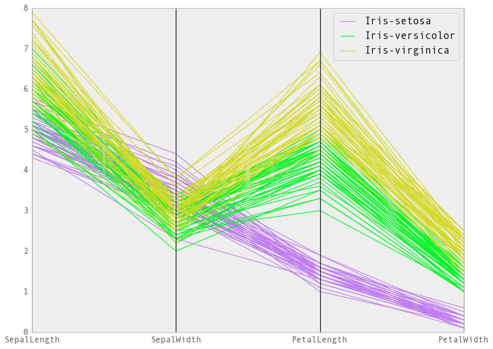

# High-Dimensional Data Visualization Exploration
<a href="mailto:bruno.carriere@gmail.com">Bruno Carriere (bruno.carriere@gmail.com)</a>

## Definition

When we talk of high-dimensional data in the context of visualization we are concerned with visualizing multivariate datasets. This is difficult because we typically think visually in terms of 3 dimensions. When dealing with very high dimensionality we are forced to used algorithms designed to flatten the dimensional space into something more manageable and projectable to 2/3D.

## Most Related To Our Project

### Parallel Coordinates

> Our dataset has a large number of attributes per item and being able to brush over various attribute ranges would be a useful way to find interesting correlations in the data.

### Star Plot aka. Spider Chart, etc

> I like the idea of using this kind of chart in a small multiples arrangement to be able to quickly compare a set of attributes between up to a dozen
groups or so. For example it could be one chart per geographical region with various spending metrics on each spoke.

### Correlation Matrix

> One of the interesting things to discover when exploring a dataset with many dimensions is unexpected correlations. A corelation matrix is good way to identify which dimensions "move together" in the same direction.

[Ref: Visualizing Correlation Matrices](http://glowingpython.blogspot.ca/2012/10/visualizing-correlation-matrices.html)

---

## Additional Picks

### Used Often: 3d Scatterplot

The scatterplot seems to be used a lot because it is quite easy to read when used with ~5 dimensions. The color and shape of the scatter can be used as a channel and the 3 dimension of the cube afford another 3 dimensions.

> Example: [Logfile Visualization](http://archive.oreilly.com/sysadmin/2007/02/02/3d-logfile-visualization.html)

The scatter plot in Figure 1 shows more than half a million HTTP page requests (each request is a dot) in 3D space. The axes are:

- X, the time axis--a full day from midnight to midnight of November 16.
- Y, the requester's IP address, with the conventional dotted decimal format sorted and given an ordinal number between 1 and 120,000, representing the number of clients that accessed the web server.
- Z, the URL (or content) sorted by popularity. Of the approximately 60,000 distinct pages on the site, the most popular URLs are near the zero point of the Z-axis and the least popular ones at the top.

### Creative and Effective: Chernoff Faces

I picked this because I had never heard of it and while it definitely is a peculiar (and somewhat silly) type of visualization, once you familiarize yourself with the parameters it becomes pretty easy to track 3-4 dimensions at once.

Example: [Professor Puts a Face on the Performance of Baseball Managers](http://www.nytimes.com/2008/04/01/science/01prof.html?_r=0)

### Favourite: Data projector

Fully interactive, very cool 3d visualization. I picked this because it is both a technical challenge in terms of programming for the browser but also because the result is a reasonably usable way to view clusters of related data in a 3 dimensional space.

[Data Projector](http://opensource.datacratic.com/data-projector)

- [VISUALIZING HIGH-DIMENSIONAL DATA IN THE BROWSER WITH SVD, T-SNE AND THREE.JS](http://datacratic.com/site/blog/visualizing-high-dimensional-data-browser-svd-t-sne-and-threejs)

## Addional Material (for further research)

- [A Beginner's Guide to Eigenvectors, PCA, Covariance and Entropy](http://deeplearning4j.org/eigenvector)
